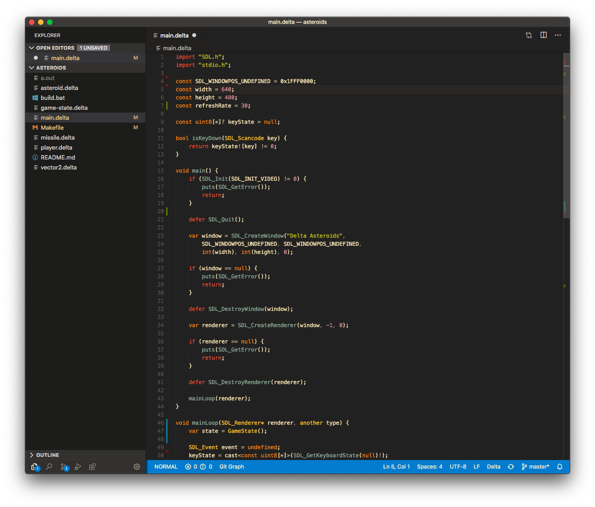

# Delta Programming Language

VSCode language support for [delta-lang](https://delta-lang.github.io).

<p align="center">
  
</p>

## Features

Syntax highlighting and some snippets. 

## Installation

Simply use the VSCode "install extensions" command and search for `delta`.

Alternatively, you can download the `.vsix` file from Releases, and run 

```
code --install-extension path/to/file.vsix
```